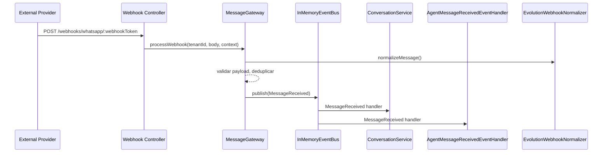
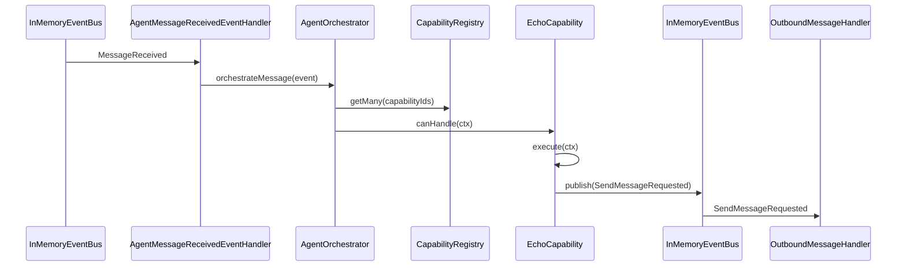
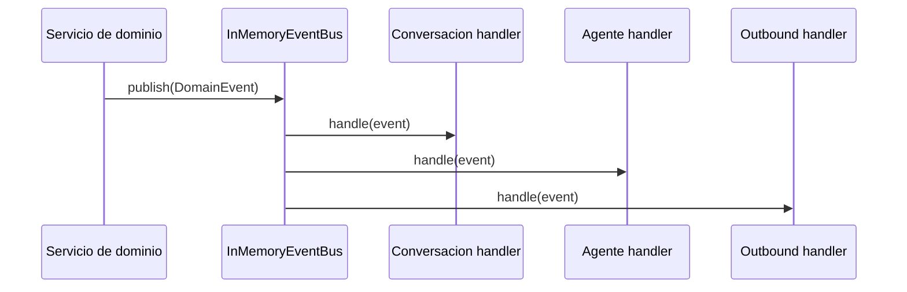

# Abiel Backend Architecture

## Visión general

Abiel Backend es un monolito modular orientado a eventos diseñado para manejar conversaciones entrantes, orquestar agentes y mantener aislamiento por tenant (`empresaId`). La integración entre módulos se realiza a través de un `EventBus` in-memory y los eventos llevan metadata de correlación y tenant.

### Principales componentes

- `gateway`: recibe webhooks externos, normaliza mensajes y publica eventos de dominio.
- `conversacion`: persiste conversaciones y mensajes, protege el estado de la conversación y habilita human intervention.
- `agente`: ejecuta agentes y capacidades, decide qué responder y publica solicitudes de envío.
- `shared`: contiene el bus de eventos, contratos de dominio, contexto de tenant y utilidades comunes.

## Módulos y responsabilidades

| Módulo | Responsabilidad principal | Contratos clave | Aislamiento tenant |
|---|---|---|---|
| `gateway` | Entrada de mensajes externos, normalización y deduplicación | `MessageReceived`, `SendMessageRequested` | `tenantId` en metadata, webhook tokens | 
| `conversacion` | Persistencia de conversaciones y mensajes, control de estado | `ConversationCreated`, `MessageCreated`, `MessagesBuffered` | Repositorios filtran por `empresaId` | 
| `agente` | Orquestación de ejecución de agente, selección de capabilities | `AgentExecutionStarted`, `AgentExecutionCompleted`, `SendMessageRequested` | `tenantId` en eventos, agent lookup por `empresaId` | 
| `shared` | EventBus, dominio de eventos, contexto de tenant | `DomainEvent`, `EventHandler`, `InMemoryEventBus` | Compartido, pero no contiene lógica tenant-specific | 

## Flujos críticos

### 1. Flujo de Webhook (Entrada)

Este flujo describe cómo un webhook externo se transforma en un evento interno que arranca el procesamiento.

#### Intención arquitectónica

- El gateway actúa como adaptador de proveedor, no conoce la lógica de conversación.
- La validación y deduplicación de webhooks ocurre antes de publicar el evento de dominio.
- `MessageReceived` es el contrato que inicia el procesamiento interno.
- El webhook token y `tenantId` aseguran aislamiento multitenant.

### 2. Flujo de Capability Pattern (Ejecución)

Este flujo muestra cómo un mensaje persistido es evaluado por capacidades de agente.

#### Intención arquitectónica

- Cada agente define capacidades ejecutables con `canHandle` y `execute`.
- El orquestador mantiene el flujo: buscar agente activo, evaluar capacidades, ejecutar la primera que coincida.
- El resultado de la capacidad no se devuelve directamente al origen; se materializa como evento `SendMessageRequested`.
- Esto desacopla la lógica de negocio de la entrega real de mensajes.

### 3. Flujo de EventBus (Comunicación inter-módulos)

El `EventBus` es el corredor que conecta productores con consumidores dentro del mismo despliegue.

#### Intención arquitectónica

- `EventBus` se utiliza para publicar eventos inmutables sin dependencia directa entre servicios.
- Los handlers deben ser idempotentes y resistentes a fallos aislados.
- Los módulos no comparten repositorios ni lógica interna, solo contratos de eventos.

## Contratos de eventos principales

### `MessageReceived`

| Campo | Tipo | Obligatorio | Descripción |
|---|---|---|---|
| `messageId` | `string` | sí | Identificador único del mensaje entrante.
| `conversationId` | `string` | sí | Identificador de conversación lógico.
| `empresaId` | `string` | sí | Tenant dueño del mensaje.

Metadata:

| Campo | Tipo | Obligatorio | Descripción |
|---|---|---|---|
| `tenantId` | `string` | sí | Debe coincidir con `empresaId`.
| `correlationId` | `string` | opcional | Trazabilidad de flujo.

### `SendMessageRequested`

| Campo | Tipo | Obligatorio | Descripción |
|---|---|---|---|
| `tenantId` | `string` | sí | Tenant destino del mensaje.
| `conversationId` | `string` | sí | Conversación relacionada.
| `messageContent` | `string` | sí | Contenido a enviar.
| `originalMessageId` | `string` | sí | Identificador del mensaje que originó la respuesta.
| `agentId` | `string` | sí | Agente que solicita el envío.
| `executionId` | `string` | sí | Ejecución de agente asociada.

Metadata:

| Campo | Tipo | Obligatorio | Descripción |
|---|---|---|---|
| `tenantId` | `string` | sí | Tenant que originó la solicitud.
| `correlationId` | `string` | opcional | Para correlación de trazas.
| `userId` | `string` | opcional | Usuario asociado al flujo.

## Regla de tenant isolation

- `empresaId` debe viajar en cada evento y repositorio.
- Los repositorios deben filtrar siempre por `empresaId` en consultas y actualizaciones críticas.
- Si un evento no incluye `tenantId`, las componentes de orquestación lo descartan o fallan.
- El gateway valida tokens de webhook y asigna el tenant antes de crear eventos.

## Archivos clave

- `src/app.ts` — wiring de dependencias, suscripción de handlers y registro de rutas.
- `src/shared/events/in-memory-event-bus.ts` — implementación simple del bus de eventos.
- `src/modules/gateway/presentation/webhook.controller.ts` — entrada HTTP de webhooks.
- `src/modules/conversacion/application/conversation-service.ts` — persistencia y estado de conversaciones.
- `src/modules/agente/application/agent-orchestrator.ts` — lógica de ejecución de agente.
- `src/modules/agente/application/echo-capability.ts` — ejemplo de capability pattern.
- `src/modules/gateway/application/outbound-message-handler.ts` — manejador de salida de mensajes.

## Recomendaciones para nuevos desarrolladores

- Cambios en los flujos deben respetar los contratos de eventos, no las clases internas de otros módulos.
- Agregar nuevas capacidades en `agente` debe hacerse vía `CapabilityRegistry` y `ExecutableCapability`.
- Si se necesita soporte para otro proveedor de webhook, implementar un `normalizer` y registrar su ruta en el `gateway`.
- Evitar inyectar `Prisma` directamente en módulos de `shared/events` o en handlers de evento.
