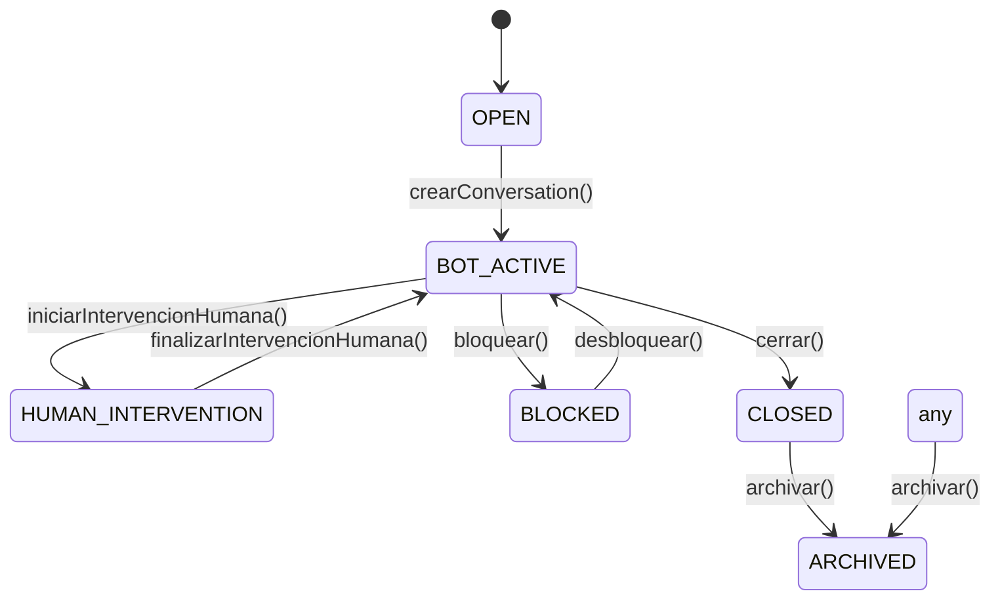

# Conversation Module Contract

## Overview
The Conversation module manages conversation lifecycle, message storage, human intervention, and message buffering for coordination with the Agent orchestrator.

## Conversation Status States

```typescript
enum ConversationStatus {
  OPEN              // Initial state, ready for messages
  BOT_ACTIVE        // Bot is actively processing and can respond
  HUMAN_INTERVENTION // Human operator has taken control, bot cannot react
  BLOCKED           // Conversation is blocked from any processing
  WAITING_AGENT     // Waiting for agent response
  HANDOFF           // Transfer between agents
  CLOSED            // Conversation ended normally
  ARCHIVED          // Historical conversation, no further changes
}
```

### State Transitions



## Domain Entities

### Conversation Aggregate
- **id**: UUID of the conversation
- **empresaId**: Tenant identifier (immutable, enforced at repository level)
- **usuarioId**: User identifier
- **titulo**: Optional conversation title
- **estado**: ConversationStatus
- **createdAt**: Timestamp
- **updatedAt**: Timestamp

**Methods:**
- `cerrar()`: Transitions to CLOSED
- `archivar()`: Transitions to ARCHIVED
- `reabrir()`: Transitions to OPEN
- `iniciarIntervencionHumana()`: Transitions to HUMAN_INTERVENTION
- `finalizarIntervencionHumana()`: Transitions to BOT_ACTIVE
- `bloquear()`: Transitions to BLOCKED
- `canProcessAgentMessage()`: Returns true if estado === BOT_ACTIVE

### Message Entity
- **id**: UUID
- **conversationId**: Foreign key to Conversation
- **empresaId**: Tenant enforcement
- **usuarioId**: Author
- **contenido**: Message text
- **rol**: MessageRole (USER, ASSISTANT, SYSTEM)
- **createdAt**: Timestamp

## Event Contracts

### ConversationCreated
Fired when a new conversation is initiated.

```typescript
interface ConversationCreatedPayload {
  conversationId: string;
  empresaId: string;
  usuarioId: string;
}
```

### MessageCreated
Fired when a message is successfully added to a conversation.

```typescript
interface MessageCreatedPayload {
  conversationId: string;
  empresaId: string;
  messageId: string;
  rol: MessageRole;
}
```

### MessageReceived
Fired when a message arrives from the external world (user input, webhook, etc.).

```typescript
interface MessageReceivedPayload {
  messageId: string;
  conversationId: string;
  empresaId: string;
}
```

**Metadata:**
- `tenantId`: empresaId (for multi-tenant enforcement)
- `correlationId`: For tracing message lineage

### HumanInterventionStarted
Fired when a human operator takes control of the conversation.

```typescript
interface HumanInterventionStartedPayload {
  conversationId: string;
  empresaId: string;
}
```

**Effect:**
- Conversation state transitions to HUMAN_INTERVENTION
- Agent orchestrator **will not** process subsequent MessageReceived events

### HumanInterventionEnded
Fired when human intervention is concluded and bot reactivation occurs.

```typescript
interface HumanInterventionEndedPayload {
  conversationId: string;
  empresaId: string;
}
```

**Effect:**
- Conversation state transitions back to BOT_ACTIVE
- Buffered messages are released for aggregation and processing

### MessagesBuffered
Fired when messages are batched after a configurable debounce period while conversation is in a non-intervention state.

```typescript
interface MessagesBufferedPayload {
  conversationId: string;
  empresaId: string;
  messages: Array<{ id: string; contenido: string; rol: MessageRole }>;
  correlationId: string;
}
```

**Responsibility:**
- Aggregates rapid consecutive MessageReceived events into a single processing unit
- Prevents duplicate agent executions for burst user input
- Respects tenant boundaries (never mixes empresaId)
- Preserves correlationId for trace continuity

## Application Services

### ConversationService

#### crearConversation(context, input)
- Creates a new conversation scoped to tenant
- Initial state: BOT_ACTIVE
- Publishes ConversationCreated
- Enforces empresaId from context

#### agregarMensaje(context, input)
- Adds a message to a conversation
- Validates conversation exists and is not CLOSED/ARCHIVED
- If conversation is HUMAN_INTERVENTION or BLOCKED, creates message but publishes MessagesBuffered instead of MessageCreated
- Returns persisted MessageProps
- Enforces empresaId from context

#### iniciarIntervencionHumana(context, conversationId)
- Transitions conversation to HUMAN_INTERVENTION
- Publishes HumanInterventionStarted event
- Subsequent messages are buffered without triggering agent execution

#### finalizarIntervencionHumana(context, conversationId)
- Transitions conversation back to BOT_ACTIVE
- Publishes HumanInterventionEnded event
- Allows buffered messages to resume aggregation

#### listarMensajes(context, conversationId)
- Returns all messages for a conversation
- Enforces tenant ownership

### MessageBufferService

#### Constructor
- **eventBus**: EventBus instance
- **conversationRepository**: For state validation
- **debounceMs**: Debounce delay in milliseconds (default: 3000)

#### handle(event: DomainEvent)
Implements EventHandler for MessageReceived events.

**Workflow:**
1. Extract tenantId from event.metadata
2. Fetch conversation state from repository
3. If conversation is HUMAN_INTERVENTION or BLOCKED, do NOT buffer (message already handled by agregarMensaje)
4. If BOT_ACTIVE, queue message for aggregation
5. Reset debounce timer
6. After debounce expires, emit MessagesBuffered with accumulated messages
7. Clear queue and reset timer

**Multi-tenant Safety:**
- Never mix messages from different empresaId in single batch
- Each conversation has its own buffer queue
- Keys are `{empresaId}:{conversationId}`

## Repository Contracts

### ConversationRepository
```typescript
interface ConversationRepository {
  create(conversation: ConversationProps): Promise<ConversationProps>;
  findById(id: string, empresaId: string): Promise<ConversationProps | null>;
  findByEmpresaId(empresaId: string): Promise<ConversationProps[]>;
  update(id: string, empresaId: string, patch: Partial<ConversationProps>): Promise<ConversationProps | null>;
}
```

**Multi-tenant Rules:**
- `findById` MUST check empresaId in WHERE clause
- `update` MUST check empresaId in WHERE clause
- Create MUST inject empresaId from caller context

### MessageRepository
```typescript
interface MessageRepository {
  create(message: MessageProps): Promise<MessageProps>;
  findByConversationId(conversationId: string, empresaId: string): Promise<MessageProps[]>;
}
```

**Multi-tenant Rules:**
- `findByConversationId` MUST verify empresaId
- No cross-tenant message retrieval

## Integration with Agent Orchestrator

### MessageReceived → BufferService
1. User sends message via API
2. ConversationService.agregarMensaje creates Message
3. If conversation is not in HUMAN_INTERVENTION/BLOCKED, publishes MessageCreated
4. MessageCreated triggers agent orchestrator's MessageReceivedEventHandler

### MessageReceived → Buffering
1. Rapid user messages come in
2. Each MessageCreated publishes a MessageReceived event
3. MessageBufferService accumulates these events
4. After debounce, publishes MessagesBuffered once
5. Agent orchestrator listens to MessagesBuffered and processes accumulated context

### Human Intervention Block
1. Operator calls iniciarIntervencionHumana
2. Conversation state becomes HUMAN_INTERVENTION
3. HumanInterventionStarted event published
4. AgentOrchestrator checks conversation state before execution
5. If HUMAN_INTERVENTION or BLOCKED, orchestrator returns null (no execution)
6. Operator sends messages (they are buffered as MessagesBuffered, not triggering agent)
7. Operator calls finalizarIntervencionHumana
8. State returns to BOT_ACTIVE
9. Buffered messages resume normal processing

## Tenant Safety Guarantees

1. **Repository Enforcement**: All queries include empresaId in WHERE clause
2. **Event Metadata**: TenantId propagated in event.metadata.tenantId
3. **Service Context**: All service methods receive TenantContext with empresaId
4. **Message Buffering**: Queue keys include empresaId to prevent cross-tenant aggregation
5. **Agent Execution**: Orchestrator validates conversation.empresaId matches event.metadata.tenantId

## Future Extensions

### Planned (Phase 2)
- Persistent message buffer (Redis/BullMQ) for resilience
- Message scheduling and delayed processing
- Conversation pause/resume without state transition
- Selective message filtering based on keywords

### Out of Scope (Phase 3+)
- Real AI runtime integration
- Multi-turn context management
- Sentiment analysis
- Message encryption

## Testing Strategy

### Unit Tests
- Buffer aggregates messages within debounce window
- Tenant isolation (no cross-tenant data leaks)
- State machine transitions
- Event emission correctness

### Integration Tests
- Full flow: User message → Buffer → Aggregation → Agent skip (if HUMAN_INTERVENTION)
- Human intervention start/end with state validation
- Conversation repository multi-tenant enforcement

### Regression Tests
- Agent orchestrator respects HUMAN_INTERVENTION state
- No orphaned timeouts after human intervention ends
- Message loss prevention on rapid succession

## Monitoring Points

1. **Event Publishing Latency**: Time from message creation to MessagesBuffered emission
2. **Debounce Effectiveness**: Average messages per batch
3. **Human Intervention Duration**: Time spent in HUMAN_INTERVENTION state
4. **Buffered Messages Count**: Max queue depth per conversation
5. **Tenant Context Validation**: Audit trail of empresaId enforcement
